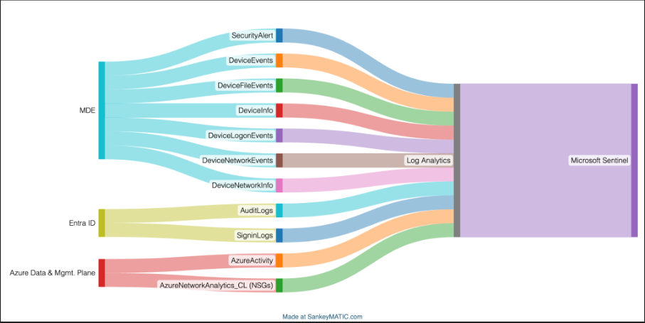
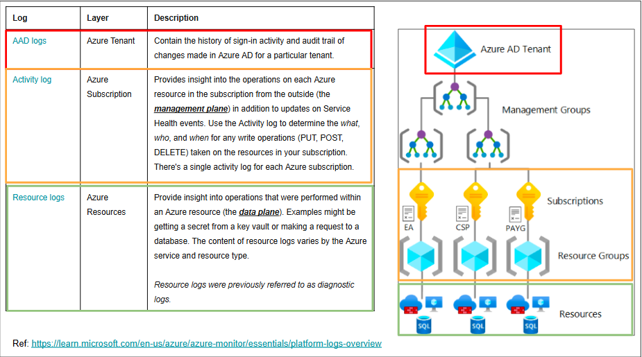
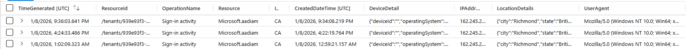
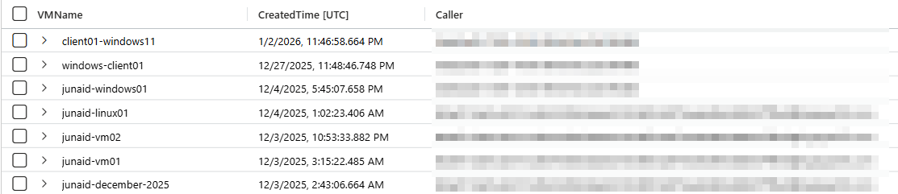

# Microsoft Sentinel Threat Hunting Cheat Sheet

> Purpose: Fast, structured threat hunting using Microsoft Sentinel (Log Analytics)  
> Focus: SOC-style investigations mapped to MITRE ATT&CK  
> Works for: Azure VMs, Microsoft Defender for Endpoint, Azure AD, Microsoft 365 logs

---

## Table of Contents
- [Sentinel Log Types & Control Plane vs Data Plane](#sentinel-log-types--control-plane-vs-data-plane)
- [Standard Sentinel Hunt Flow](#standard-sentinel-hunt-flow)
- [MITRE ATT&CK Phases — Sentinel View](#mitre-attck-phases--sentinel-view)
  - [Initial Access (TA0001)](#initial-access-ta0001)
  - [Execution (TA0002)](#execution-ta0002)
  - [Persistence (TA0003)](#persistence-ta0003)
  - [Defense Evasion (TA0005)](#defense-evasion-ta0005)
  - [Discovery (TA0007)](#discovery-ta0007)
  - [Credential Access (TA0006)](#credential-access-ta0006)
  - [Command and Control (TA0011)](#command-and-control-ta0011)
  - [Collection (TA0009)](#collection-ta0009)
  - [Exfiltration (TA0010)](#exfiltration-ta0010)
  - [Lateral Movement (TA0008)](#lateral-movement-ta0008)
  - [Anti-Forensics / Impact (TA0005 / TA0040)](#anti-forensics--impact-ta0005--ta0040)
- [Sentinel Analyst Final Checklist](#sentinel-analyst-final-checklist)

---

## Sentinel Log Types & Control Plane vs Data Plane

Understanding **where logs originate** and **what layer they represent** is critical for efficient threat hunting in Microsoft Sentinel. Not all logs answer the same questions, and mixing control-plane and data-plane telemetry can lead to missed findings or incorrect conclusions.

### Log Ingestion Flow (High-Level)
Microsoft Sentinel ingests telemetry from multiple sources (MDE, Entra ID, Azure platform logs) into **Log Analytics**, where they become queryable for hunting, detections, and investigations.



---

### Control Plane vs Data Plane — Why It Matters

| Layer | What It Answers | Example Questions |
|-----|----------------|------------------|
| **Control Plane** | *Who changed or accessed configuration?* | Who deleted a VM? Who changed NSG rules? Who disabled logging? |
| **Data Plane** | *What actually happened inside the workload?* | Who logged into the VM? What process executed? What network connection occurred? |




---

### Common Sentinel Log Categories

#### Entra ID / Azure AD Logs (Control Plane – Identity)
- **Tables:** `SigninLogs`, `AuditLogs`
- Track authentication activity and directory changes at the tenant level
- Used for detecting:
  - Suspicious sign-ins
  - MFA bypass or failures
  - Risky users and sessions
---

> Example Query: Review User Sign-in Activity

**Use case:**  
Validate suspicious authentication events by reviewing IP address, location, device details, and user agent for a specific user or identity.

```kql
SigninLogs
| where Identity contains "<USER_OR_OBJECT_ID>"
| project
    TimeGenerated,
    OperationName,
    Resource,
    IPAddress,
    LocationDetails,
    DeviceDetail,
    UserAgent
| order by TimeGenerated desc
```



#### Azure Activity Logs (Control Plane – Subscription)
- **Table:** `AzureActivity`
- Records management operations on Azure resources (PUT, DELETE, UPDATE)
- You can use this table to find VMs created in a Resource Group etc.
- Also can be used for detecting:
  - Resource/VM deletion or modification
  - Privilege abuse

> Example Query: Review Azure Control Plane Activity

**Use case:**
Review **management-plane actions** performed against Azure resources (such as virtual machines, disks, or network components) to identify suspicious administrative behavior, failed execution attempts, or abuse of service principals.

This query is especially useful for detecting:

* Azure Run Command usage
* Unauthorized configuration changes
* Failed or blocked administrative actions
* Service principal activity targeting resources

```
AzureActivity
| where ResourceGroup contains "<RESOURCE_GROUP_NAME>"
| project
    TimeGenerated,
    OperationNameValue,
    ActivityStatusValue,
    ActivitySubstatusValue,
    ResourceProviderValue,
    Resource,
    Caller,
    CallerIpAddress,
    CategoryValue,
    CorrelationId
| order by TimeGenerated asc
```

> To view all the VMs created in your ResourceGroup

```
AzureActivity
| where TimeGenerated > ago(200d)
| where ResourceGroup has "80aefc1da61a82315cd63933b0d6aa6281026fd5428f1ea664963480857ff8eb"
| where OperationNameValue == "MICROSOFT.COMPUTE/VIRTUALMACHINES/WRITE"
| where ActivityStatusValue == "Success"
| extend rid = tolower(_ResourceId) // Normalize casing so string matching and splitting is reliable
| extend AfterVM = split(rid, "/virtualmachines/")[1] // [1] means after the anchor, while [0] means before
| extend VMName = tostring(split(AfterVM, "/")[0]) Extract the VM name by taking the 0th index before the next "/"
| summarize CreatedTime = min(TimeGenerated), Caller = any(Caller) by VMName
| order by CreatedTime desc
```

---


#### Azure Resource Logs (Data Plane – Workload)
- Formerly known as *Diagnostic Logs*
- Capture actions **within** a resource (e.g., SQL queries, storage access, Key Vault access)
- Used for detecting:
  - Data access
  - Service misuse
  - Application-level abuse

#### Defender for Endpoint Logs (Data Plane – Endpoint)
- **Tables:** `DeviceProcessEvents`, `DeviceLogonEvents`, `DeviceNetworkEvents`, etc.
- Capture real activity on endpoints
- Used for detecting:
  - Initial access
  - Execution
  - Persistence
  - Lateral movement
  - Exfiltration

---

### Threat Hunting Guidance
- Use **control-plane logs** to answer *who changed what and when*
- Use **data-plane logs** to answer *what actually happened on the system*
- Most **attack behavior** appears in **data-plane telemetry**
- Most **environment impact or tampering** appears in **control-plane telemetry**

Understanding this distinction helps you choose the **right table first**, reducing noise and speeding up investigations.


## Standard Sentinel Hunt Flow

1. Initial Access  
2. Execution  
3. Persistence  
4. Defense Evasion  
5. Discovery  
6. Credential Access  
7. Command and Control  
8. Collection  
9. Exfiltration  
10. Lateral Movement  
11. Anti-Forensics / Impact  

---

## MITRE ATT&CK Phases — Sentinel View

---

## Initial Access (TA0001)
> Think: How did the attacker gain access, from where and using what identity

### What to Look For
- Successful logons from external IPs
- Failures followed by success (password spray/ brute force)
- RDP / SMB / SSH access
- Valid account abuse
- New Device / New browser 
- Rare geo / impossible travel patterns 
- First-seen IPs for the account or host

### Primary Tables

**Endpoint (MDE via Sentinel)** 

- `DeviceLogonEvents` 
- `DeviceNetworkEvents` 
- `SignInLogs` (To View ENTRA ID(AD) Logs for Azure.. remember its Azure logins)


### High-Signal Indicators
- `LogonType == RemoteInteractive` (RDP) OR `LogonType == Network`
- External `RemoteIP`
-  `ActionType == LogonSuccess` after multiple failures
-  First-time-seen IP for the account in the last 30–90 days

### Go-To Sentinel Query

**MDE: Successful logons + external IP summary**
```
let startTime = datetime(2025-10-24 18:55:00);
let endTime   = datetime(2025-12-24 19:10:00);
DeviceLogonEvents
| where TimeGenerated between (startTime .. endTime)
| where DeviceName has "azuki"
| where ActionType == "LogonSuccess"
| summarize Count=count(), FirstSeen=min(TimeGenerated), LastSeen=max(TimeGenerated)
  by AccountName, LogonType, RemoteIP
| order by Count desc, LastSeen desc
````
## Initial Access Validation — Failed Logons Followed by Success (Same IP/User)

**Title:** Failure-to-Success Correlation (Password Spray / Brute Force / Stolen Creds)  
**Use case:** Use this during **Initial Access (TA0001)** to confirm suspicious access patterns where an attacker generates multiple failed logons and then successfully authenticates shortly after (often from the same source IP). This helps validate **credential guessing**, **password spraying**, or **use of newly-compromised credentials**.

### Optional parameters (edit as needed)
- `deviceFilter`: set to a hostname (or partial) to scope to a single device, or leave empty for all devices  
- `window`: how long after the *last failure* you want to consider a “related” success  

```kql
// =====================================================
// Query: Failure-to-Success Correlation (Initial Access)
// Purpose: Find accounts/IPs where logon failures are
//          followed by a successful logon within a
//          defined time window.
// Tables: DeviceLogonEvents (MDE)
// =====================================================

// Time bounds for the investigation window
let startTime   = datetime(2025-10-24 18:55:00);
let endTime     = datetime(2025-12-24 19:10:00);

// Correlation window: success must occur within this timespan after the last failure
let window      = 30m;

// Optional: Scope to a specific device (leave empty "" to search all devices)
let deviceFilter = ""; // e.g., "azuki-sl" or "windows-target-1"

// -------------------------------
// Collect failed logons
// -------------------------------
let fails =
DeviceLogonEvents
| where TimeGenerated between (startTime .. endTime)
| where isempty(deviceFilter) or DeviceName has deviceFilter
| where ActionType == "LogonFailed"
| summarize
    FailCount = count(),
    LastFail  = max(TimeGenerated)
  by AccountName, RemoteIP, LogonType;

// -------------------------------
// Collect successful logons
// -------------------------------
let success =
DeviceLogonEvents
| where TimeGenerated between (startTime .. endTime)
| where isempty(deviceFilter) or DeviceName has deviceFilter
| where ActionType == "LogonSuccess"
| summarize
    FirstSuccess = min(TimeGenerated),
    SuccessCount = count()
  by AccountName, RemoteIP, LogonType;

// -------------------------------
// Correlate: success happens soon after last failure
// -------------------------------
fails
| join kind=inner success on AccountName, RemoteIP, LogonType
| where FirstSuccess >= LastFail
| where FirstSuccess <= LastFail + window
| project
    AccountName,
    RemoteIP,
    LogonType,
    FailCount,
    LastFail,
    FirstSuccess,
    SuccessCount
| order by FirstSuccess asc
```

###  Tier 2

**Azure AD: Successful sign-ins with context (IP, location, user agent, CA)**
```
let startTime = datetime(2025-10-24 18:55:00);
let endTime   = datetime(2025-12-24 19:10:00);
SigninLogs
| where TimeGenerated between (startTime .. endTime)
| where ResultType == 0
| project TimeGenerated, UserPrincipalName, AppDisplayName, IPAddress,
          Location, UserAgent, ConditionalAccessStatus, AuthenticationRequirement
| order by TimeGenerated desc
```

**First-seen IP for a user (great for confirming suspicious source)**
```
let lookback = 30d;
SigninLogs
| where TimeGenerated > ago(lookback)
| where ResultType == 0
| summarize FirstSeen=min(TimeGenerated), LastSeen=max(TimeGenerated), Count=count()
  by UserPrincipalName, IPAddress
| order by FirstSeen asc
```


---

## Execution (TA0002)
> Think: “What code or command actually ran on the system after access was gained?”
> - Focus on **process execution**, not intent or outcome (those map to later phases)

### What to Look For

* Script execution
* Living-off-the-land binaries (LOLBins)
* PowerShell with suspicious arguments

### Primary Tables

* `DeviceProcessEvents`


### Common Binaries

* `powershell.exe`
* `cmd.exe`
* `mshta.exe`
* `wscript.exe`
* `certutil.exe`

### Go-To Sentinel Query

```kql
let startTime = datetime(2025-10-24 18:55:00);
let endTime   = datetime(2025-12-24 19:10:00);
DeviceProcessEvents
| where TimeGenerated between (startTime .. endTime )
| where DeviceName contains "azuki"
| where FileName in ("powershell.exe","cmd.exe","mshta.exe","wscript.exe","certutil.exe")
| project TimeGenerated, DeviceName, FileName, ProcessCommandLine, AccountName
```

---

## Persistence (TA0003)
> How do i stay after reboot without logging in agian?

### What to Look For

* Scheduled task creation
* New services
* New local administrator accounts
* Registry Run keys

### Primary Tables

* `DeviceProcessEvents: (what executes after reboot)`
* `DeviceRegistryEvents: (Run keys, persistence registry entries)`

### Key Commands

* `schtasks.exe /create`
* `net user /add`
* `sc create`

### Go-To Sentinel Queries

**Scheduled Task Creation**

```kql
DeviceProcessEvents
| where FileName == "schtasks.exe"
| where ProcessCommandLine has "/create"
```

**Local Account Creation**

```kql
SecurityEvent
| where EventID == 4720
| project TimeGenerated, Account, TargetAccount
```

---

## Defense Evasion (TA0005)

### What to Look For

* Windows Defender exclusions
* Hidden files or folders
* Log clearing
* Antivirus tampering

### Primary Tables

* `DeviceRegistryEvents`
* `DeviceProcessEvents`

### Defender Registry Locations

* `Exclusions\Paths`
* `Exclusions\Extensions`
* `Exclusions\Processes`

### Go-To Sentinel Query

```kql
DeviceRegistryEvents
| where RegistryKey has "Windows Defender\\Exclusions"
| project TimeGenerated, RegistryKey, RegistryValueName
```

---

## Discovery (TA0007)

### What to Look For

* Network enumeration
* User or session discovery
* System information gathering

### Primary Tables

* `DeviceProcessEvents`

### Common Commands

* `arp -a`
* `ipconfig`
* `net view`
* `whoami`
* `qwinsta`

### Go-To Sentinel Query

```kql
DeviceProcessEvents
| where ProcessCommandLine has_any ("arp","ipconfig","net view","whoami","qwinsta")
| project TimeGenerated, FileName, ProcessCommandLine
```

---

## Credential Access (TA0006)

### What to Look For

* LSASS memory access
* Mimikatz-style modules
* Short or renamed executables

### Primary Tables

* `DeviceProcessEvents`
* `SecurityEvent` (Event IDs 4688, 4673)

### High-Confidence Indicators

* `sekurlsa::logonpasswords`
* `privilege::debug`

### Go-To Sentinel Query

```kql
DeviceProcessEvents
| where ProcessCommandLine has_any ("sekurlsa","logonpasswords","privilege::debug")
| project TimeGenerated, FileName, ProcessCommandLine
```

---

## Command and Control (TA0011)

### What to Look For

* Outbound traffic from non-browser processes
* Repeated connections to the same IP
* HTTPS abuse (port 443)

### Primary Tables

* `DeviceNetworkEvents`
* `CommonSecurityLog` (firewalls)

### High-Signal Patterns

* Non-browser processes communicating over port 443
* Same `RemoteIP` appearing across multiple phases

### Go-To Sentinel Query

```kql
DeviceNetworkEvents
| where InitiatingProcessFileName !in ("chrome.exe","msedge.exe","firefox.exe")
| project TimeGenerated, InitiatingProcessFileName, RemoteIP, RemotePort
```

---

## Collection (TA0009)

### What to Look For

* File compression
* Data staging
* ZIP or RAR archive creation

### Primary Tables

* `DeviceProcessEvents`
* `DeviceFileEvents`

### Go-To Sentinel Query

```kql
DeviceProcessEvents
| where ProcessCommandLine has_any ("Compress-Archive",".zip",".rar")
| project TimeGenerated, ProcessCommandLine
```

---

## Exfiltration (TA0010)

### What to Look For

* Cloud service abuse
* Upload traffic after data staging
* Long-running HTTPS sessions

### Primary Tables

* `DeviceNetworkEvents`
* `OfficeActivity` (Microsoft 365)

### Common Services

* Discord
* Dropbox
* Google Drive
* OneDrive
* Telegram

### Go-To Sentinel Query

```kql
DeviceNetworkEvents
| where RemotePort == 443
| where InitiatingProcessFileName !in ("chrome.exe","msedge.exe")
| project TimeGenerated, RemoteIP, InitiatingProcessFileName
```

---

## Lateral Movement (TA0008)

### What to Look For

* Internal RDP connections
* Credential reuse
* Administrative tool abuse

### Primary Tables

* `DeviceProcessEvents`
* `DeviceLogonEvents`
* `SecurityEvent` (Event ID 4624)

### Common Tools

* `mstsc.exe`
* `cmdkey.exe`
* `psexec.exe`

### Go-To Sentinel Query

```kql
DeviceProcessEvents
| where ProcessCommandLine has_any ("mstsc","cmdkey","psexec")
| project TimeGenerated, FileName, ProcessCommandLine
```

---

## Anti-Forensics / Impact (TA0005 / TA0040)

### What to Look For

* Event log clearing
* Evidence destruction
* Account manipulation

### Primary Tables

* `DeviceProcessEvents`
* `SecurityEvent`

### High-Risk Command

* `wevtutil cl`

### Go-To Sentinel Query

```kql
DeviceProcessEvents
| where ProcessCommandLine has "wevtutil"
| where ProcessCommandLine has "cl"
| project TimeGenerated, ProcessCommandLine
```

---

## Sentinel Analyst Final Checklist

* ☐ Initial access IP and account identified
* ☐ Execution method confirmed
* ☐ Persistence mechanisms identified and removed
* ☐ Credential theft validated
* ☐ Command-and-control infrastructure identified
* ☐ Exfiltration channel confirmed
* ☐ Lateral movement scoped
* ☐ Impact assessed
* ☐ Remediation recommendations provided

---

> This cheat sheet is intended for defensive threat hunting and SOC operations only.


## Other useful KQL queries.. 

```
AzureActivity
| where TimeGenerated >= ago(7d)
| where ResourceProviderValue =~ "Microsoft.Compute"
| where tolower(ResourceGroup) == tolower("student-rg")
| where OperationNameValue contains "DELETE"
| where ActivityStatusValue == "Success"
| order by TimeGenerated, Caller desc
| project TimeGenerated, OperationNameValue, ResourceGroup, Caller, CategoryValue
```

## KQL Cheat Sheet – Pre vs Post Event Process Comparison (Delta Analysis)

### Purpose
Compare process execution behavior **before and after a known event** (crash, alert, outage) to identify:
- New processes
- Stopped processes
- Significant execution increases or decreases

This technique is used to validate incidents, detect persistence, and identify environmental degradation.

---

### KQL Query – Process Delta Comparison

```kql
// Define the PRE-event window
let pre = 
DeviceProcessEvents
| where DeviceName == "windows-target-1"            // Target host
| where TimeGenerated between                       // Time window BEFORE event
    (datetime(2025-11-20) .. datetime(2025-11-24))
| summarize PreCount = count() by FileName;          // Count executions per process

// Define the POST-event window
let post =
DeviceProcessEvents
| where DeviceName == "windows-target-1"             // Same host
| where TimeGenerated between                        // Time window AFTER event
    (datetime(2025-11-24) .. datetime(2025-11-28))
| summarize PostCount = count() by FileName;         // Count executions per process

// Join both datasets to compare behavior
pre
| join kind=fullouter post on FileName               // Include processes that started or stopped
| extend 
    PreCount  = coalesce(PreCount, 0),               // Replace nulls with 0
    PostCount = coalesce(PostCount, 0)
| extend Delta = PostCount - PreCount                // Calculate execution change
| order by Delta desc                                // Show biggest increases first


